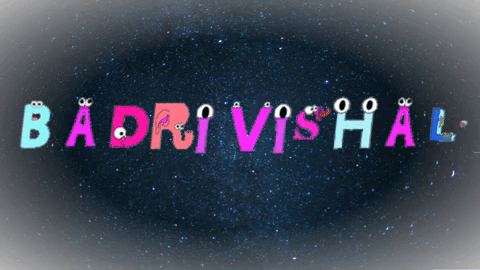

  

  <h1 align="center">Hi, I'm Badri Vishal</h1>

  

  

    <b>Senior Engineer @Quadric IO | MS by Research @ IIT Bombay | Ex-SDE @ Amazon</b>
  

  

    
    
    
  

---

### 👨‍💻 About Me

- 💼 **Current Role:** Senior Compiler Engineer at **Quadric IO**, building a Deep Learning Graph Compiler for the Chimera software stack.
- 🎓 **Education:** MS by Research at **IIT Bombay** (CSE Dept), guided by Prof. Ganesh Ramakrishnan and Prof. Parag Chaudhuri.
- 💼 **Experience:** Former SDE at **Amazon**, focusing on accelerating digital payment experiences and seamless integration systems.
- 🚀 **Interests:** Coding, System Design, Generative AI, and developing scalable architectures.

---

### 📊 GitHub Analytics

  <table>
    <tr>
      <td align="center" width="50%">
        
      </td>
      <td align="center" width="50%">
         
      </td>
    </tr>
  </table>
   
  

---

### 🛠️ Tech Stack

<table align="center">
  <tr>
    <td align="center" width="90"><b>Languages</b></td>
    <td>
      
      
      
      
      
      
      
    </td>
  </tr>
  <tr>
    <td align="center" width="90"><b>Tools & OS</b></td>
    <td>
      
      
      
      
      
    </td>
  </tr>
  <tr>
    <td align="center" width="90"><b>Frameworks</b></td>
    <td>
      
      
    </td>
  </tr>
</table>

---

### 📰 Publications

| Paper Title | Area |
| :--- | :--- |
| **TEXTRON** | Weakly Supervised Multilingual Text Detection through Data Programming |
| **SPRINT** | Script-agnostic Structure Recognition in Tables |
| **PLATTER** | A Page-Level Handwritten Text Recognition System for Indic Scripts |
| **DRISHTIKON** | Multi-Granular Visual Grounding for Text-Rich Document Images |

---

### 📌 Featured Projects

  
  
  

